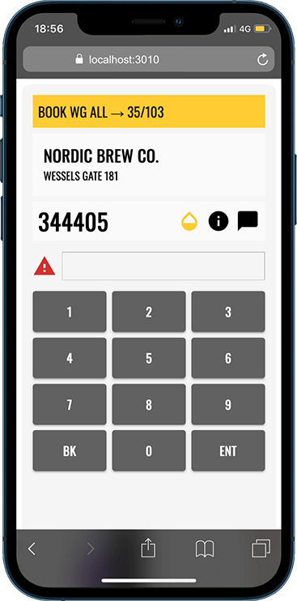

# MeterTrack React

## Overview
MeterTrack is a utility meter reading web application built with **React, Material-UI, and Webpack**.
It helps users manage and record utility meter readings efficiently.

**Note:** This project is a "Work In Progress".



## Setup Instructions
### **Clone the Repository**
```sh
git clone https://github.com/yourusername/metertrack-react.git
cd metertrack-react
```

### **Install Dependencies**
```sh
npm install
```

### **Start the Development Server**
```sh
npm run dev
```
Runs the app in development mode at `http://localhost:3000/`.

### **Build for Production**
```sh
npm run build
```
Compiles the app into the `/dist` folder for deployment.

---

## **Project Structure**
```
/metertrack-react
│── /src
│   ├── /components      # Reusable UI components
│   ├── /pages           # Page components
│   ├── /context         # Global state (React Context API)
│   ├── /assets          # Static images & assets
│   ├── index.js         # App entry point
│   ├── App.js           # Main application component
│── /public              # Static HTML
│── /dist                # Production build output
│── webpack.config.js    # Webpack configuration
│── .babelrc             # Babel configuration
│── package.json         # Project dependencies
│── README.md            # Documentation
```
---

<a href="https://www.flaticon.com/free-icons/water-meter" title="water meter icons">Water meter icons created by Umeicon - Flaticon</a>
