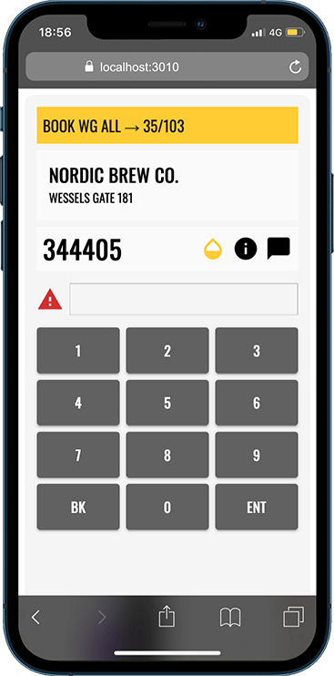

# Software Design Document for MeterTrak

**Version 1.0 (Pending)**  
**DNKY Software**  
**Date: 23 March 2025**

Prepared by: **Steven Thompson**

---

# 1. INTRODUCTION

This Software Design Document (SDD) describes the internal architecture, component structure, and operational design of the **MeterTrak** application.

MeterTrak is an offline-first utility meter reading application intended for use by field technicians, contractors, and local government staff. It is being developed as a portfolio-quality demonstration project, with the potential to evolve into a commercial-grade product if adopted by an organisation or software development partner.

- Class hierarchies and interactions
- Data flow and design
- Processing narratives
- Algorithmic models
- Design constraints and restrictions
- User interface design
- Test cases and expected results

This document outlines the system’s design decisions, constraints, and technical structure in sufficient detail to support further development, testing, or adaptation by other developers.

## **1.1 GOALS AND OBJECTIVES**

The purpose of MeterTrak is to modernise and streamline the utility meter reading process, especially in environments that require ruggedised, offline-capable data capture tools such as local councils and field service teams. MeterTrak aims to replace legacy handheld systems with a reliable, user-friendly, and offline-first web application that supports seamless data collection, review, and submission of meter readings.

The primary objective of the MeterTrak project is to develop a field-ready application that allows utility workers to efficiently perform meter reading tasks with minimal training or technical overhead.

To meet these objectives, the application must be fast, fault-tolerant, and intuitive. It must be capable of operating in remote or disconnected locations, offer efficient input interfaces (such as a customised NumPad), and support synchronisation with backend systems when a connection is available. The user interface should minimise friction, provide real-time feedback, and accommodate a wide range of reading types and conditions.

Beyond these overarching principles, MeterTrak must also provide the following concrete features and functionalities:
- **Support for multiple meter types** (e.g. water, gas, electricity)
- **Customisable reading entry interface**, including support for codes such as “SKIPPED” or “NEW”
- **Offline-first architecture** using local IndexedDB storage
- **Daily route loading and review**, allowing users to view assigned properties and meters
- **Support for text and numeric inputs**, including negative and special readings (e.g. tampered or unreadable meters)
- **Built-in validation and data formatting rules** to reduce operator error
- **Batch export of collected data** for integration with external systems
- **Support for rugged device display themes and interaction**s (e.g. large buttons, high contrast)
- **Session persistence and fail-safe recovery** in the event of unexpected shutdowns

By prioritising usability, accuracy, and offline capability, MeterTrak seeks to deliver a field tool that enhances productivity, improves data quality, and reduces reliance on outdated or proprietary hardware solutions.

## **1.2 PROJECT OVERVIEW AND SCOPE**

MeterTrak is a standalone web-based utility designed for field staff to collect and manage utility meter readings efficiently, particularly in locations with limited or no internet connectivity. The system is being developed as a
**Progressive Web Application (PWA)** and is intended to run on ruggedised mobile and desktop devices in local government and utility contexts.

The system consists of two primary components:
- A **client-side web application** responsible for capturing meter readings, navigating assigned routes, and storing data locally.
- A **backend system** (future scope) responsible for synchronising route assignments and uploading collected readings to a central database for billing and auditing.

For this initial release, the project will focus exclusively on **local-first functionality**, simulating data loading and storage without relying on backend integration. This will ensure that core functionality can be developed and tested
independently before future API-based extensions are added.

The system’s functionality can be broken down into **core features** and **future enhancements**, as outlined below:

## **CORE FEATURES**

1. **ROUTE MANAGEMENT**
    - Load a predefined list of properties/meters from local storage or mock API
    - Display routes grouped by street or zone
    - Filter routes by read status (e.g. read, unread, skipped)
2. **METER READING INTERFACE**
    - Tap-to-edit interface for entering readings
    - Custom NumPad for numeric and text entry
    - Real-time formatting and validation of inputs
3. **READING TYPES AND CODES**
    - Support for standard numeric readings
    - Allow special string values such as "SKIPPED", "NEW", and "TAMPERED"
    - Store raw input for compatibility with legacy systems
4. **LOCAL STORAGE AND RECOVERY**
    - Readings stored using IndexedDB for offline use
    - Auto-save after each reading
    - Recovery mechanism on app reload
5. **DAILY SUMMARY VIEW**
    - Summary of readings completed, skipped, and remaining
    - Optional visual indicators for route progress
6. **DATA EXPORT**
    - Export all readings to JSON or CSV for backend upload or review
    - Include metadata such as timestamps and status

The features below are not guaranteed to be present in the final release of MeterTrak, but will be added as time permits. Due to their tentative nature, they will not be covered in this document.

## **ADDITIONAL FEATURES**

1. **Backend Synchronisation**
    - Enable secure syncing of readings and routes with a cloud or on-premises server, ensuring data consistency across devices and systems.
2. **User Authentication and Role Management**
    - Implement login functionality for assigning routes to individual users and restricting access based on roles (e.g. reader, supervisor, admin).
3. **Integrated GPS and Mapping**
    - Incorporate geolocation support for tracking field progress and displaying meter locations on an interactive map.
4. **Photo Capture for Damaged Meters**
    - Allow users to attach photographs to individual readings when encountering broken, unreadable, or tampered meters.
5. **Signature Capture**
    - Provide a digital signature pad to confirm meter access, tenant permission, or visit verification when required.
6. **Administrative Dashboard**
    - Develop a web-based admin interface to assign daily routes, monitor progress in real-time, and review submitted data.
7. **Push Notifications**
    - Integrate alerts for unread routes, sync reminders, or custom notices from the admin portal to field users.

## **1.3 SOFTWARE CONTEXT**

MeterTrak is being developed as a modern, browser-based Progressive Web Application (PWA) designed primarily for offline use in the field. Its architecture prioritises data resilience, simplicity of deployment, and compatibility with
ruggedised devices typically used by utility service staff and local councils.

For the initial release, MeterTrak will operate in **standalone mode**, relying solely on local data stored in **IndexedDB**, a browser-native database. This approach allows the application to function fully without an internet connection,
making it ideal for field environments where connectivity is intermittent or unavailable.

Future versions will integrate MeterTrak with external backend systems via secure RESTful APIs. However, for the purposes of prototyping and early field testing, all route data and readings will be simulated or manually loaded into the
local environment. This ensures that development can proceed independently of backend readiness.

The application is intended to run on a variety of devices, including:
- Rugged Android tablets
- Windows-based tablets or convertibles
- Laptops with offline-capable browsers (e.g. Chrome, Edge)

All application logic, including route navigation, data entry validation, and export functionality, is handled entirely in the browser. This self-contained model simplifies deployment, reduces maintenance, and provides a fast and
responsive user experience without requiring app store distribution or installation.

By combining a lightweight front-end stack with robust offline capabilities, MeterTrak offers a future-proof foundation for field data collection in utility contexts, with potential for integration, expansion, and automation in future
phases.

## **1.4 MAJOR CONSTRAINTS**

The primary constraint for the MeterTrak project is time. Development, testing, and documentation are being handled by a solo developer within a limited timeframe. As this version of MeterTrak focuses on an
offline-first web application, additional time is required to implement robust local storage and data handling mechanisms. While some planned features may be deferred to later phases, the core functionality of capturing and managing meter
readings will remain unaffected in the initial release.

## **1.5 INTENDED AUDIENCE AND READING SUGGESTIONS**

While the Software Requirements Specification (SRS) document is written for a broader audience, this Software Design Document (SDD) is intended for individuals directly involved in the design and development of the MeterTrak application. This includes software developers, technical consultants, and project stakeholders responsible for implementation and testing.

This document supports non-linear reading; readers may jump to sections relevant to their role or interest.

Below is a brief overview of each section:

- Part 1 (Introduction)
    - Provides an overview of the MeterTrak project, including goals and objectives, project scope, software context, major constraints, and the intended audience.
- Part 2 (Data Design)
    - Describes how data is structured and stored within the application, including local storage strategy (IndexedDB), temporary objects, and potential backend integration.
- Part 3 (Architectural and Component-Level Design)
    - Details the core modules, components, and data flows of the system, including class-level designs and interface interactions.
- Part 4 (User Interface Design)
    - Outlines the user experience, layout principles, and UI behaviours of the application, with notes on usability under field conditions.
- Part 5 (Restrictions, Limitations, and Constraints)
    - Summarises the technical and practical limitations of the current build, including deferred features and hardware considerations.
- Part 6 (Testing Issues)
    - Covers the approach to validation, test cases, performance considerations, and how correctness and data integrity will be verified.
-  Part 7 (Appendices)
   Includes supplementary materials such as mock data formats, export templates, or additional references useful during implementation.

---