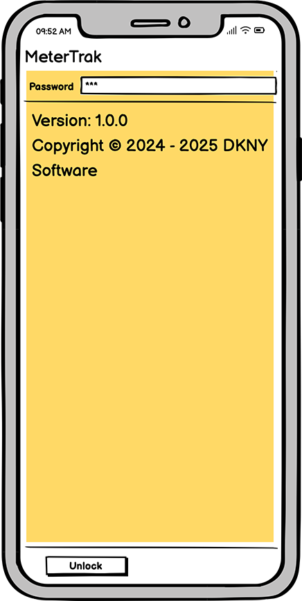
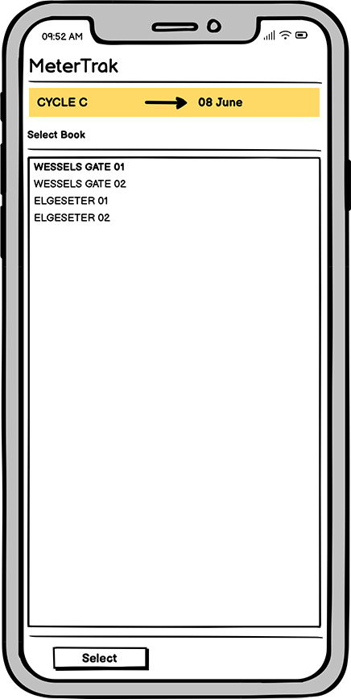
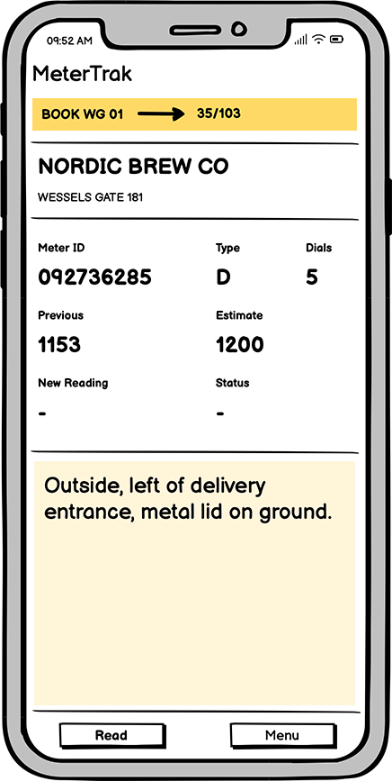
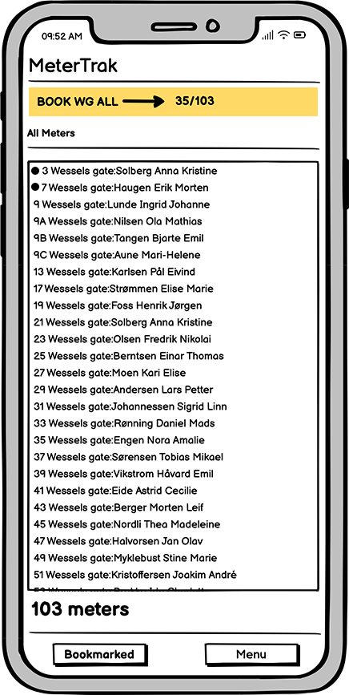
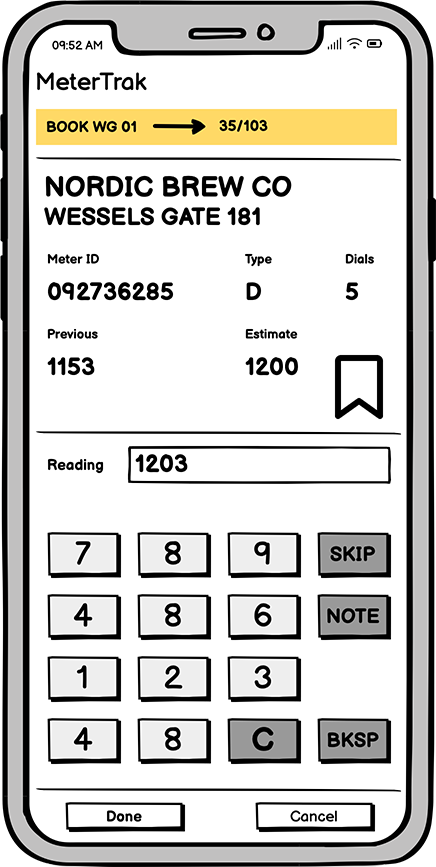
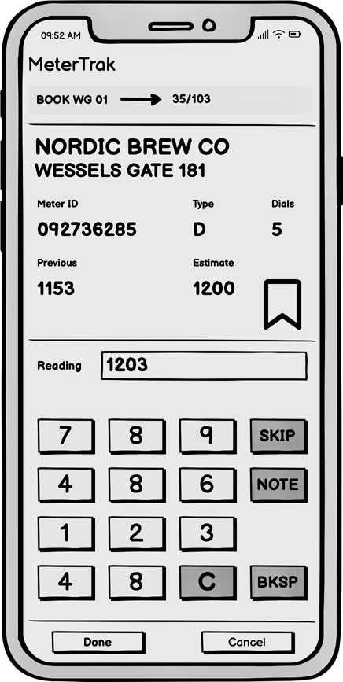
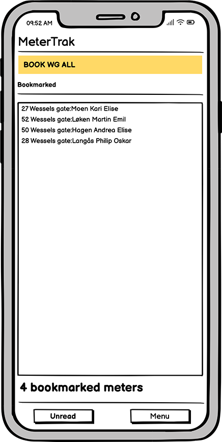
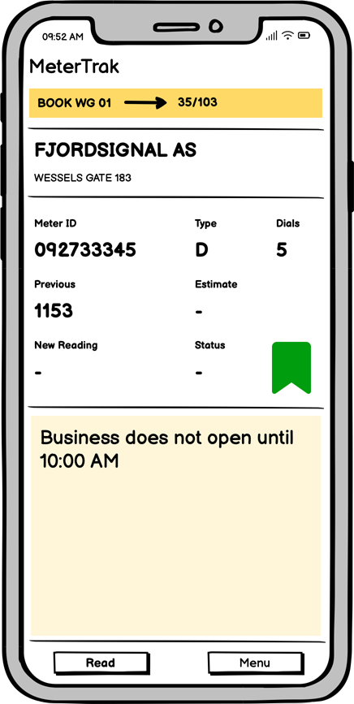

# User Guide: Using MeterTrak

Switch on the device and tap **MeterTrak**

A splash screen will display briefly before a logon screen.

## Password

Log in to start reading meters

Use the on-screen keyboard or the physical keypad to access MeterTrak.

- On-screen: enter **m3t3r** and tap **Unlock**

- Keypad: type **6 (MNO)**, **3 (DEF)**, **8 (TUV)**, **3 (DEF)**, **7 (QRS)**, then press **ENTER**

---

## Select Book

Choose the correct reading cycle

If your device has more than one book assigned, a selection screen will appear.

- Confirm that the reading cycle is the current one

- If unsure which reading cycle to select, consult your supervisor.

- Tap the book name, then tap **Select**

---

## Meter

View your first assigned meter

After selecting a book, the first meter in the run appears.

- Review the meter details including location, ID, and previous reading

- A dash (–) means there is no reading value in the billing system

- Tap **Menu** > **Run** to see the full list of meters

## Run/Walk

Navigate the meter list and manage readings

The Run/Walk screen shows all meters for the selected book.

- Tap any meter to read it out of sequence

- Tap **Reading** or press **Enter** to begin a reading

- A ● before the meter indicates it has already been read

- Tap **Menu** > **Unread** to view missed meters

- Tap **Bookmarked** to view bookmarked meters

Read meters are indicated by a preceding dot (●). Tap **Menu > Unread** to view missed meters or **Bookmarked** to view bookmarked meters only. This also serves as a simple audit trail, helping you track which meters have been read, skipped, or bookmarked for later follow-up.

## Read

Enter and manage meter readings

When viewing a meter, you can enter readings manually and manage optional settings.

- Tap **Done** or press **Enter** to save

- Tap **Cancel** to exit without saving

- Tap **Skip** to skip this meter

- Add notes using the **Note** field if necessary

- Review the expected number of dials before entering a value

## Warnings

Understand warning messages and how to respond

Certain warnings may appear during meter entry. Here's what they mean:

- **Dials Exceeded**: You've entered more digits than expected. Tap **Cancel** to retry, or **OK** if the expectation is wrong.

- **Less than Previous**: Reading is less than the last recorded value.

  - Tap **Yes** if the meter has rolled over

  - Tap **No** if the previous reading was incorrect

  - Tap **Cancel** if the current entry is wrong

- **Reading Variance**: Value differs from the estimate. Tap **OK** to accept or **Cancel** to re-enter.

### Example Warning Scenarios

- **Dials Exceeded**  
  Example: The expected number of digits is 5, but the reader enters `123456`. Tap **Cancel** to retry, or **OK** if the meter is known to have rolled over into an extra digit.

- **Less than Previous**  
  Example: The last recorded reading was `98452`, but the reader enters `00341`. If the meter has rolled over, tap **Yes**. If the last reading was incorrect, tap **No**.

- **Reading Variance**  
  Example: The estimate for this period is `10420`, but the entered value is `70210`. If confirmed with a recheck, tap **OK**. Otherwise, tap **Cancel** to enter a new reading.

## Bookmark

Mark meters to return to later

If a meter is temporarily inaccessible, such as being blocked by a vehicle, you can bookmark it.

- Tap **Bookmark** while viewing a meter

- To revisit bookmarks, tap **Run**, then tap **Bookmarked** to filter the list.

> **Example Bookmark**  
> This meter was bookmarked at 09:52 AM with a note indicating the business opens at 10:00 AM. The reader will return later to complete the reading.

---

*Guide last updated: March 2025*
